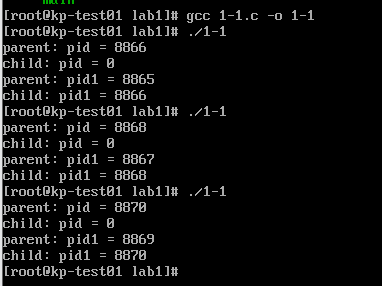
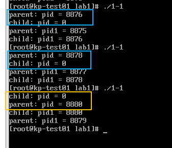
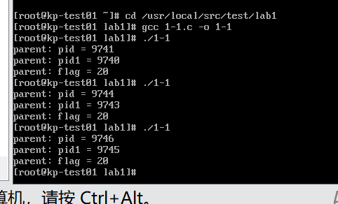
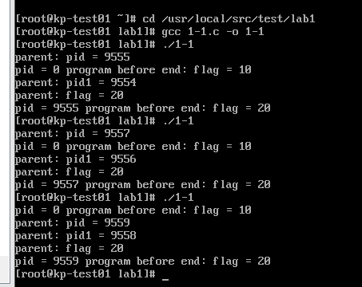
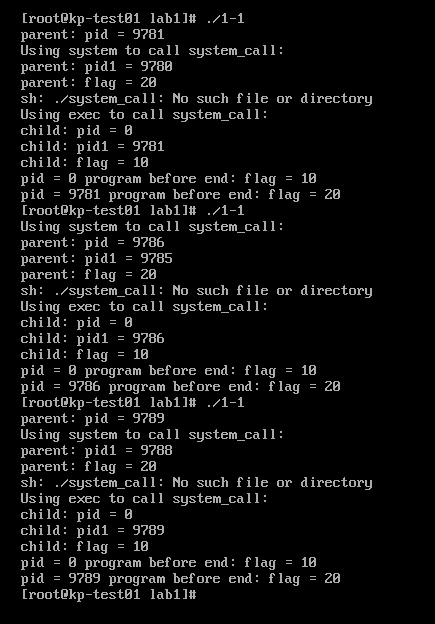
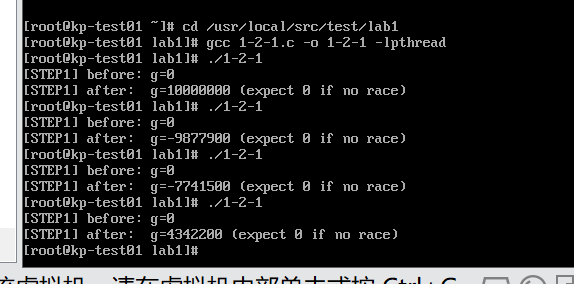
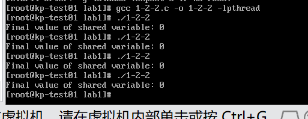
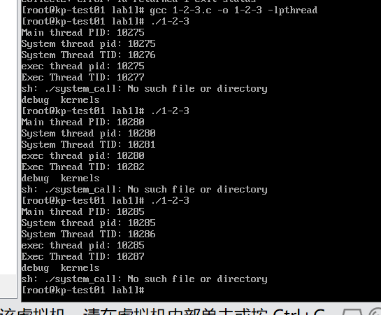
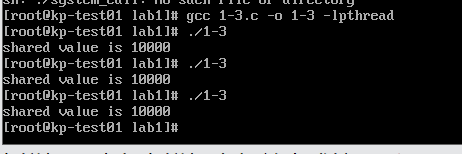

# OSlab1
计算机2304 赵思嘉 2233123334
***
# 1.1 进程相关编程实验

##  实验1:编写并多次运行图 1-1 中代码

本实验通过在程序中输出父、子进程的 pid，分析父子进程 pid 之间的关系，进一步加入 wait()函数分析其作用。
```步骤1、2#include <stdio.h>
#include <sys/types.h>
#include <unistd.h>
#include <sys/wait.h>
int main() {
  pid_t pid, pid1;//存储进程ID
    pid = fork(); //通过fork()创建子进程
  if (pid < 0) {// fork失败时输出错误信息，并返回值1
    fprintf(stderr, "fork failed");
    return 1;
  } 
  else if (pid==0) {  // pid=0表示当前在子进程，把id赋值给pid1
    pid1 = getpid();
    printf("child: pid = %d\n", pid);
    printf("child: pid1 = %d\n", pid1);
  }
 else {  // 父进程
    pid1 = getpid();
    printf("parent: pid = %d\n", pid);// 打印父进程中fork()的返回值（子进程ID）
    printf("parent: pid1 = %d\n", pid1);// 打印父进程的ID
    wait(NULL); // 父进程等待子进程结束；在步骤2中删去
  }
  return 0;
}
```



**问题：隐式函数声明警告**    
- **描述：** 在最初的版本中，使用了 **`wait(NULL)`** 函数，但没有包含 **`<sys/wait.h>`** 头文件，导致编译器发出“implicit declaration of function”警告。    
- **解决：** 在代码中加入 **`#include <sys/wait.h>`** 来解决这个问题。
##  实验2:删去图 1-1 代码中的 wait()函数并多次运行程序，分析运行结果。
```步骤1、2#include <stdio.h>
#include <sys/types.h>
#include <unistd.h>
#include <sys/wait.h>
int main() {
  pid_t pid, pid1;//存储进程ID
    pid = fork(); //通过fork()创建子进程
  if (pid < 0) {// fork失败时输出错误信息，并返回值1
    fprintf(stderr, "fork failed");
    return 1;
  } 
  else if (pid==0) {  // pid=0表示当前在子进程，将id赋值给pid1
    pid1 = getpid();
    printf("child: pid = %d\n", pid);
    printf("child: pid1 = %d\n", pid1);
  }
 else {  // 父进程
    pid1 = getpid();
    printf("parent: pid = %d\n", pid);// 打印父进程中fork()的返回值（子进程ID）
    printf("parent: pid1 = %d\n", pid1);// 打印父进程的ID
  }
  return 0;
}
```


可以发现当前情况下存在child有可能先于parent进程运行。(黄色框起部分）

在多进程编程中，wait() 或 waitpid() 函数的核心作用是让父进程等待子进程结束，从而保证父子进程的执行顺序。wait() 函数会让父进程进入阻塞状态，直到其中一个子进程结束（或收到信号）才会被唤醒并继续执行。

如果删掉 wait() 相关函数，父进程可能在子进程之前结束，导致父子进程的执行顺序失控.没有 wait() 时，父进程不会等待子进程，而是继续执行自己的代码；子进程也会并行执行。此时可能子进程先执行完，父进程后执行；也可能父进程先执行完，子进程还在运行（甚至父进程已经退出，子进程变成 “孤儿进程”，被 init 进程接管）。
##  实验3:修改图 1-1 中代码，增加一个全局变量并在父子进程中对其进行不同的操作，观察并解释所做操作和输出结果。
```
#include <stdio.h>      
#include <stdlib.h>    
#include <sys/types.h>  
#include <unistd.h>    
#include <sys/wait.h>   

int main() {
  pid_t pid, pid1;      // 存储进程ID
  int flag;             // flag
  
  pid = fork();         // 调用fork()创建子进程，返回值赋给pid;父进程中返回子进程ID，子进程中返回0，失败返回-1

  if (pid < 0) {       
    fprintf(stderr, "fork failed");  //失败，输出错误信息，返回值1表示错误
    return 1;          
  } 
  else if (pid == 0) {  // 执行的是子进程
    pid1 = getpid();    // 获取当前子进程的ID，赋给pid1
    flag = 10;          // 子进程中给flag赋值10
  } 
  else {                // 执行父进程（pid为子进程ID）
    pid1 = getpid();    // 把当前父进程的ID赋给pid1
    flag = 20;          // 父进程中给flag赋值20
    printf("parent: pid = %d\n", pid);     // 打印父进程中fork()返回的子进程ID
    printf("parent: pid1 = %d\n", pid1);   // 打印父进程自身的ID
    printf("parent: flag = %d\n", flag);   // 打印父进程中flag的值（20）
    wait(NULL);         // 父进程调用wait(NULL)，阻塞等待子进程结束后再继续执行
  }
  return 0;             // 进程正常退出
}
```


我定义了一个全局变量flag，在parent进程中修改其为20，child进程中修改为10，并分别打印结果。

注意到父进程与子进程先后交替运行

##  实验4:在3基础上，在 return 前增加对全局变量的操作（自行设计）并输出结果，观察并解释所做操作和输出结果
```
#include <stdio.h>      
#include <stdlib.h>    
#include <sys/types.h>  
#include <unistd.h>    
#include <sys/wait.h>   

int main() {
  pid_t pid, pid1;      // 存储进程ID
  int flag;             // flag
  
  pid = fork();         // 调用fork()创建子进程，返回值赋给pid;父进程中返回子进程ID，子进程中返回0，失败返回-1

  if (pid < 0) {       
    fprintf(stderr, "fork failed");  //失败，输出错误信息，返回值1表示错误
    return 1;          
  } 
  else if (pid == 0) {  // 执行的是子进程
    pid1 = getpid();    // 获取当前子进程的ID，赋给pid1
    flag = 10;          // 子进程中给flag赋值10
  } 
  else {                // 执行父进程（pid为子进程ID）
    pid1 = getpid();    // 把当前父进程的ID赋给pid1
    flag = 20;          // 父进程中给flag赋值20
    printf("parent: pid = %d\n", pid);     // 打印父进程中fork()返回的子进程ID
    printf("parent: pid1 = %d\n", pid1);   // 打印父进程自身的ID
    printf("parent: flag = %d\n", flag);   // 打印父进程中flag的值（20）
    wait(NULL);         // 父进程调用wait(NULL)，阻塞等待子进程结束后再继续执行
  }

  // 增加的内容；父子进程都会执行以下代码（进程调度决定执行顺序，父进程因wait会等待子进程）
  printf("pid = %d program before end: flag = %d\n", pid, flag);
  return 0;             // 进程正常退出
}
```



##  实验5:修改图 1-1 程序，在子进程中调用 system()与 exec 族函数。 编写system_call.c 文件输出进程号 PID，编译后生成 system_call 可执行文件。在子进程中调用 system_call,观察输出结果并分析总结。
```
#include <stdio.h>
#include <stdlib.h>
#include <sys/types.h>
#include <unistd.h>
#include <sys/wait.h>
int main() {
  pid_t pid, pid1;//存储进程ID
  int flag; //全局变量  
  pid = fork(); //通过fork()创建子进程
  if (pid < 0) {// fork失败时输出错误信息，并返回值1
    fprintf(stderr, "fork failed");
    return 1;
  } else if (pid==0) {  // pid=0表示当前在子进程，将id赋值给pid1
    pid1 = getpid();
    flag = 10;

    // 使用system函数调用system_call
    printf("Using system to call system_call:\n");
    system("./system_call");

    // 使用exec函数族调用system_call
    printf("Using exec to call system_call:\n");
    execlp("./system_call", "./system_call", NULL);

    // 如果execlp成功，进程已经被替换，以下代码不会执行
    printf("child: pid = %d\n", pid);// 打印子进程中fork()的返回值（0）
    printf("child: pid1 = %d\n", pid1);// 打印子进程的ID
    printf("child: flag = %d\n", flag);// 打印子进程中flag的值（10）
  } else {  // 父进程
    pid1 = getpid();
    flag = 20;
    printf("parent: pid = %d\n", pid);// 打印父进程中fork()的返回值（子进程ID）
    printf("parent: pid1 = %d\n", pid1);// 打印父进程的ID
    printf("parent: flag = %d\n", flag);// 打印父进程中flag的值（20）
    wait(NULL); // 父进程等待子进程结束
  }
  printf("pid = %d program before end: flag = %d\n", pid, flag);
  return 0;
}
```


# 1.2 线程相关编程实验
## 实验一： 设计程序，创建两个子线程， 两线程分别对同一个共享变量多次操作，观察输出结果。
```c
#define _GNU_SOURCE      
#include <stdio.h>       
#include <stdlib.h>      
#include <pthread.h>      // 线程库
#include <unistd.h>      
static long long g = 0;   // 静态全局共享变量g，初始值为0，将被两个线程操作
static const int N = 100000;  // 常量N，表示每个线程的循环操作次数（10万次）

// 线程对共享变量g累加
void* add_worker(void* _) {
    for (int i = 0; i < N; i++) {  
        long long tmp = g;         // 读取共享变量g的值到临时变量tmp
        if ((i & 1023) == 0)       // 每1024次循环（i为1023的倍数时）触发一次线程让步
            sched_yield();         // 主动放弃CPU执行权，让其他线程有机会运行，放大竞态条件
        tmp += 100;                
        g = tmp;                   // 将修改后的tmp写回共享变量g
    }
    return NULL;  // 线程执行完毕，返回空指针
}

// 线程对共享变量g递减
void* sub_worker(void* _) {
    for (int i = 0; i < N; i++) {  
        long long tmp = g;         // 读取共享变量g的值到临时变量tmp
        if ((i & 1023) == 0)       // 每1024次循环触发一次线程让步
            sched_yield();         // 主动放弃CPU，增加线程切换概率
        tmp -= 100;              
        g = tmp;                   // 将修改后的tmp写回共享变量g
    }
    return NULL;  // 返回空指针
}

int main(void) {
    pthread_t t1, t2;  // 标识创建的线程
    printf("[STEP1] before: g=%lld\n", g);  // 打印操作前共享变量g的初始值（0）

    // 创建第一个线程，执行add_worker函数（累加操作）
    if (pthread_create(&t1, NULL, add_worker, NULL) != 0) {
        perror("pthread_create");  // 创建失败
        exit(1);                  
    }
    // 创建第二个线程，执行sub_worker函数（递减操作）
    if (pthread_create(&t2, NULL, sub_worker, NULL) != 0) {
        perror("pthread_create");  // 创建失败
        exit(1);                  
    }

    // 主线程等待t1线程执行完毕
    pthread_join(t1, NULL);
    // 主线程等待t2线程执行完毕
    pthread_join(t2, NULL);

    // 打印操作后共享变量g的值，并提示"无竞态条件时预期为0"
    printf("[STEP1] after:  g=%lld (expect 0 if no race)\n", g);
    return 0; 
}
```


此时输出的结果并不固定，因为程序没有进行线程同步。当多个线程访问和修改同一个共享变量（**`shared_variable`**）而没有进行任何形式的同步时，程序的行为就变得不可预测。

一个线程正在尝试增加变量的值，而另一个线程正在尝试减少它。这两个操作可能几乎同时发生，因为操作系统的调度器可以随时中断一个线程并转而执行另一个线程。这样的话，两个线程可能会“看到”共享变量几乎同时的不同值，或者同时对它进行修改，从而导致不一致的结果。


## 实验二： 修改程序， 定义信号量 signal，使用 PV 操作实现共享变量的访问与互斥。运行程序，观察最终共享变量的值。

同步（Synchronization）在多线程编程中指的是协调多个线程的执行，以确保它们能够正常、可预测地访问共享资源或完成某些任务。互斥（Mutual Exclusion）是同步的一种特殊形式，确保一次只有一个线程能访问某个特定的资源或代码段。互斥通常通过互斥锁（Mutex）来实现，但它也可以通过其他机制来实现，比如信号量（Semaphore）。信号量和互斥锁类似，但更为通用。信号量可以用来解决除了互斥之外的其他同步问题。

PV操作：P操作通常用于申请或等待资源，而V操作用于释放或发出信号。

**P操作**

- P操作检查信号量的值。
    - 如果信号量的值大于0，那么它将减少信号量的值（通常是减1）并继续执行。
    - 如果信号量的值为0，线程将被阻塞，直到信号量的值变为大于0。

**V操作**

- V操作增加信号量的值（通常是加1）。
- 如果有线程因执行P操作而阻塞在这个信号量上，一个或多个线程将被解除阻塞，并被允许减少信号量的值。

在C语言中，使用POSIX信号量

- **`sem_wait(&semaphore);`**：执行P操作。
- **`sem_post(&semaphore);`**：执行V操作。

其中，**`semaphore`**是一个**`sem_t`**类型的变量，代表信号量。

**`sem_init`**和**`sem_destroy`**是POSIX信号量（Semaphores）的初始化和销毁函数，它们用于设置和清理信号量。

**`sem_init`**

这个函数用于初始化一个未命名的信号量。

```c
int sem_init(sem_t *sem, int pshared, unsigned int value);
```

- **sem**: 一个指向信号量对象的指针。
- **pshared**: 如果这个参数是0，信号量就是当前进程的局部信号量。如果这个参数非0，则该信号量在多个进程间共享。
- **value**: 信号量的初始值。

这个函数成功时返回0，失败时返回-1。

**`sem_destroy`**

这个函数用于销毁一个未命名的信号量，释放其占用的资源。

```c
int sem_destroy(sem_t *sem);
```

- **sem**: 一个指向信号量对象的指针。

这个函数成功时返回0，失败时返回-1。在使用**`sem_destroy`**之前，确保没有线程被阻塞在该信号量上。

整体的代码为：

```c
#include <stdio.h>      
#include <stdlib.h>   
#include <pthread.h>   
#include <semaphore.h>  

int shared_variable = 0;  // 共享变量，初始值为0，将被两个线程操作

sem_t semaphore;  // 信号量变量，用于实现线程同步

// 线程函数：对共享变量进行递增操作
void *increment() {
    for (int i = 0; i < 5000; i++) {
        sem_wait(&semaphore);  // 信号量等待：若信号量值>0则减1并继续；若=0则阻塞等待
        shared_variable++;     // 临界区操作：修改共享变量（递增）
        sem_post(&semaphore);  // 信号量释放：将信号量值加1，唤醒可能阻塞的线程
    }
    return NULL;  // 线程执行完毕，返回空指针
}

// 线程函数：对共享变量进行递减操作
void *decrement() {
    for (int i = 0; i < 5000; i++) {
        sem_wait(&semaphore);  // 信号量等待：进入临界区前获取同步锁
        shared_variable--;     // 临界区操作：修改共享变量（递减）
        sem_post(&semaphore);  // 信号量释放：离开临界区后释放同步锁
    }
    return NULL;  // 线程执行完毕，返回空指针
}

int main() {
    pthread_t thread1, thread2;  // 定义两个线程ID变量，用于标识创建的线程
    // 初始化信号量：参数分别为信号量地址、是否进程间共享（0表示线程间共享）、初始值（1表示互斥锁功能）
    if (sem_init(&semaphore, 0, 1) == -1) {
        perror("Failed to initialize semaphore");  // 初始化失败时打印错误信息
        exit(1);  // 异常退出程序
    }
    // 创建第一个线程，执行递增操作
    if (pthread_create(&thread1, NULL, increment, NULL) != 0) {
        perror("Failed to create thread1");  // 创建失败
        exit(1);  // 异常退出程序
    }

    // 创建第二个线程，执行递减操作
    if (pthread_create(&thread2, NULL, decrement, NULL) != 0) {
        perror("Failed to create thread2");  // 创建失败
        exit(1); 
    }

    // 主线程等待thread1线程执行完毕
    pthread_join(thread1, NULL);
    // 主线程等待thread2线程执行完毕
    pthread_join(thread2, NULL);

    sem_destroy(&semaphore);  // 销毁信号量，释放相关资源
    printf("Final value of shared variable: %d\n", shared_variable);  // 打印共享变量的最终值（预期为0）

    return 0;  
}
```



步骤三： 在第一部分实验了解了 system()与 exec 族函数的基础上，将这两个函数的调用改为在线程中实现，输出进程 PID 和线程的 TID 进行分析。

```c
#include <pthread.h>    
#include <stdio.h>      
#include <unistd.h>     
#include <stdlib.h>     
#include <syscall.h>    // 系统调用接口
// 线程函数1执行system调用
void *system_thread_function() {
    // 打印当前线程的TID（线程ID），通过syscall(SYS_gettid)获取
    printf("System Thread TID: %ld\n", syscall(SYS_gettid));
    // 调用system函数执行外部程序./system_call（需提前存在该程序）
    system("./system_call");
    return NULL;  // 线程执行完毕返回
}

// 线程函数2：执行exec系列调用
void *exec_thread_function() {
    // 打印当前线程的TID（线程ID）
    printf("Exec Thread TID: %ld\n", syscall(SYS_gettid));
    // 定义execvp的参数列表：执行"ls /usr/src"命令，NULL表示参数结束
    char *args[] = {"ls", "/usr/src", NULL};
    // 调用execvp执行程序：替换当前进程（线程）的代码段为ls程序
    // 若成功，后续代码（包括return）不会执行
    execvp(args[0], args);
    return NULL;  // 若execvp失败才会执行到这里（通常不会执行）
}

int main() {
    pthread_t system_thread, exec_thread;  // 定义两个线程ID变量

    // 打印主线程所属进程的PID（进程ID），主线程与进程PID相同
    printf("Main thread PID: %d\n", getpid());

    // 创建第一个线程，执行system_thread_function
    if (pthread_create(&system_thread, NULL, system_thread_function, NULL)) {
        fprintf(stderr, "Error creating system thread\n");  // 创建失败时输出错误
        return 1;  // 异常退出
    }

    // 创建第二个线程，执行exec_thread_function
    if (pthread_create(&exec_thread, NULL, exec_thread_function, NULL)) {
        fprintf(stderr, "Error creating exec thread\n");  // 创建失败时输出错误
        return 1;  // 异常退出
    }

    // 主线程等待system_thread执行完毕
    pthread_join(system_thread, NULL);
    // 主线程等待exec_thread执行完毕
    // 注意：若execvp成功，该线程已被替换为ls进程，退出后join仍能捕获，但线程函数后续代码不执行
    pthread_join(exec_thread, NULL);

    return 0;  
}
```



程序不会自动终止，因为exec运行后使得该线程无法返回NULL终止。解决方案是在exec之前先fork一个进程，在子进程中调用exec

```c
// system调用执行外部程序
void *system_thread_function() {
    // 打印当前线程所属进程的PID（所有线程共享进程ID）
    printf("System thread pid: %d\n", getpid());
    
    // 通过系统调用SYS_gettid获取、打印当前线程的TID，同一进程内不同线程TID不同
    printf("System Thread TID: %ld\n", syscall(SYS_gettid));

    // 创建新的子进程运行systemcall，当前线程会阻塞等待其执行完毕
    system("./system_call");
    
    return NULL;  // 线程执行完毕，返回空指针
}

// 通过fork+exec组合执行外部程序
void *exec_thread_function() {
    // 打印当前线程所属进程的PID（与主线程、其他线程相同）
    printf("exec thread pid: %d\n", getpid());
    
    // 打印当前线程的TID
    printf("Exec Thread TID: %ld\n", syscall(SYS_gettid));
    
    // 调用fork，在父进程中返回子进程PID，在子进程中返回0，失败返回-1
    pid_t pid = fork();
    
    if (pid == 0) {  // 子进程分支
        char *args[] = {"ls", "/usr/src", NULL};// 定义execvp的参数列表：执行"ls /usr/src"命令，NULL表示参数结束
        execvp(args[0], args);// 调用execvp替换子进程的代码段为ls程序
        // 若成功，子进程后续代码（包括exit）不会执行；若失败则继续执行
        exit(0);  // 若execvp失败，执行exit退出子进程（避免子进程继续运行）
    } 
    else if (pid > 0) {  // 父进程（当前线程）分支
        int status;  // 存储子进程的退出状态
        waitpid(pid, &status, 0);  // 调用waitpid等待子进程结束，并获取其退出状态
        // 第一个参数为子进程PID，第二个参数存储状态，第三个参数0表示阻塞等待
    } 
    else {  // fork失败分支
        perror("fork");  // 打印fork失败的错误信息
    }
    
    return NULL;  // 线程执行完毕，返回空指针
}
```

可以看到线程共享进程的PID，但会有自身独立的线程TID，同时system在实际过程中会调用fork但是这个行为被封装起来了   

# 实验3 自旋锁实验

## 实验： 在进程中给一变量赋初值并成功创建两个线程，在两个线程中分别对此变量循环五千次以上做不同的操作（自行设计）并输出结果，使用自旋锁实现互斥和同步； 

```c
#include <pthread.h>  // 线程库
#include <stdio.h>    
#include <stdlib.h>   

// 用flag标识锁的状态（0表示未锁定，1表示已锁定）
typedef struct {
  int flag;  
} spinlock_t;

// 初始化锁的状态为未锁定（flag=0）
void spinlock_init(spinlock_t *lock) { 
    lock->flag = 0; 
}

// 获取自旋锁（加锁操作）
void spinlock_lock(spinlock_t *lock) {
    // 将lock->flag设置为1（锁定状态）返回该变量的旧值
    // 若旧值为1（已被锁定），则进入while循环"自旋等待"（不断重试）
    // 若旧值为0（未锁定），则跳出循环，表示成功获取锁
    while (__sync_lock_test_and_set(&lock->flag, 1)) { 
        // 空循环：自旋等待期间，线程会持续占用CPU，不放弃执行权
    }
}
// 释放自旋锁（解锁操作）
void spinlock_unlock(spinlock_t *lock) {
    // 将lock->flag设置为0（未锁定状态），并确保操作的内存可见性
    __sync_lock_release(&lock->flag); 
}

// 共享变量：将被两个线程同时操作
int shared_value = 0;

// 线程函数：对共享变量进行5000次递增操作（受自旋锁保护）
void *thread_function(void *arg) {
    // 将传入的参数转换为自旋锁指针（线程共享该锁）
    spinlock_t *lock = (spinlock_t *)arg;
    // 循环5000次，每次操作共享变量前加锁，操作后解锁
    for (int i = 0; i < 5000; ++i) {
        spinlock_lock(lock);    // 获取锁：若已被占用则自旋等待
        shared_value++;         // 临界区操作：安全修改共享变量
        spinlock_unlock(lock);  // 释放锁：允许其他线程获取
    }
    return NULL;  // 线程执行完毕返回
}

int main() {
    pthread_t thread1, thread2;  // 两个线程ID变量
    spinlock_t lock;             // 自旋锁变量

    spinlock_init(&lock);  // 初始化自旋锁（设置为未锁定状态）

    // 第一个线程，执行thread_function，传入自旋锁地址作为参数
    if (pthread_create(&thread1, NULL, thread_function, &lock) != 0) {
        perror("Failed to create thread1");  // 创建失败
        exit(1);  
    }

    // 第二个线程，执行相同的线程函数，共享同一个自旋锁
    if (pthread_create(&thread2, NULL, thread_function, &lock) != 0) {
        perror("Failed to create thread2");  // 创建失败
        exit(1); 
    }

    // 等待第一个线程执行完毕
    pthread_join(thread1, NULL);
    // 等待第二个线程执行完毕
    pthread_join(thread2, NULL);

    // 打印共享变量的最终值（预期为10000，因两个线程各加5000次）
    printf("shared value is %d\n", shared_value);

    return 0; 
}
```



自旋锁设定成功，每个线程都正确地对shared_value进行了修改
